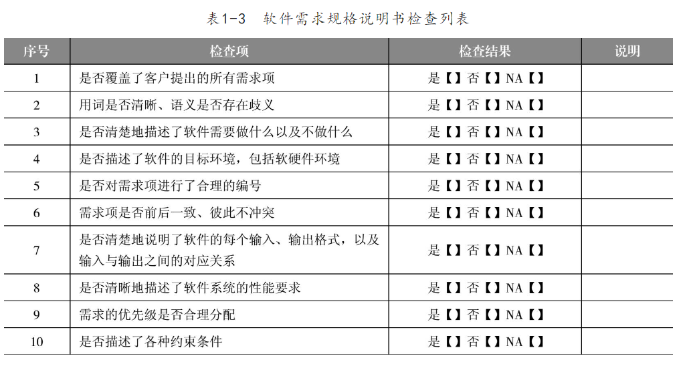
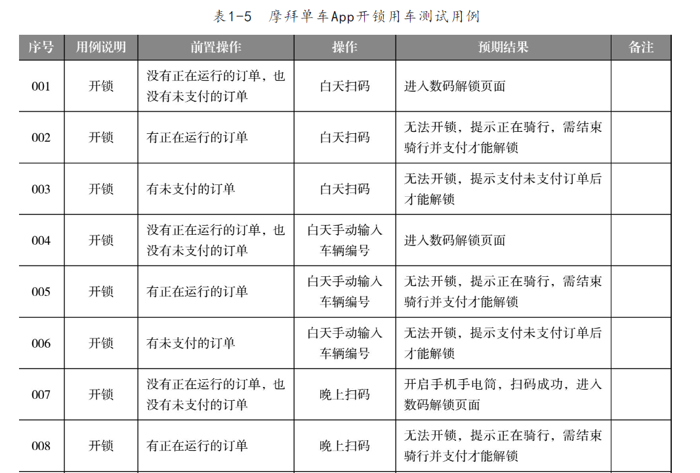
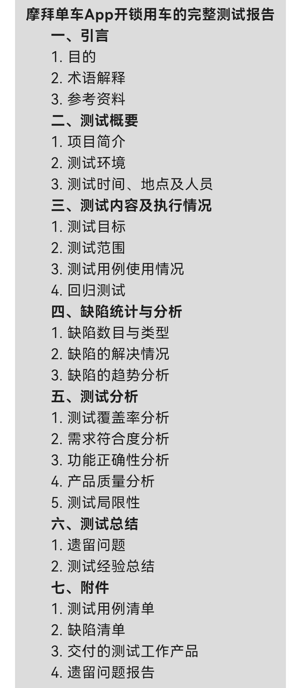

######测试内容

#####1.测试用例的设计方法:
 等价类划分法

测试需求分析后，需要查看表1-3检查是否完整。
 

######2.设计测试用例
    核心得测试用例：
    以共享单车为例：
    1.白天：扫码开锁；
    2.白天：手动输入车辆编号开锁；
    3.晚上：扫码+手电筒开锁；
    4.晚上：手动输入车辆编号开锁。
    开锁模块与其它模块关联，开锁时，如果有正在运行得订单或者有未支付得订单，则无法开锁。
    具体操作参考表1-5。用例中需要包括用例说明、前置操作、操作、预期结果、备注。

######3。完成测试报告
    完整得测试报告见下图，可参考下图完成。

    测试报告包括其部分，尽可能得详细描述，测试报告一般长达十几页甚至时几十页得word文档。

######4.第一章小结：
     1.软件得生命周期：
     2.软件开发模型：
     3.软件质量；
     4.软件缺陷管理：原因、分类、处理流程及常用的缺陷管理工具：
     5.软件测试的概念、目的、分类：软件测试的原则、测试与软件开发的关系；
     6.软件测试的基本流程：

